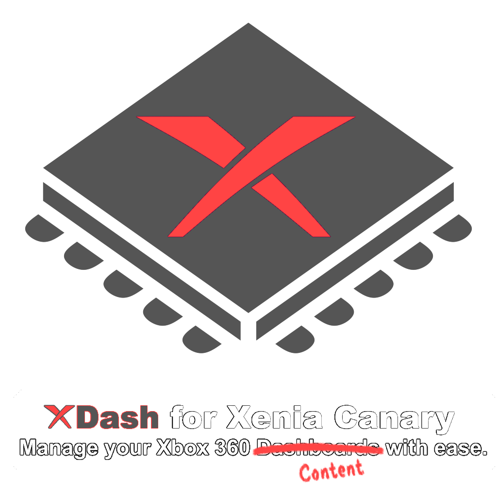

<p align="center">
    <a href="https://github.com/Voltarian-Technologies/XDash/">
        
    </a>
</p>

## 📋 Overview

XDash is a professional GUI application for managing and launching Xbox 360 content using the Xenia Canary emulator. Designed with both keyboard/mouse and game controller support, it provides an intuitive interface for loading custom dashboards, homebrew, and other Xbox 360 applications with various Xenia configurations.

## ✨ Features

### 🎮 **Controller Support**
- **Dual Controller Backend**: Supports both XInput (Xbox controllers) and DirectInput (SDL2) controllers
- **Automatic Input Management**: Automatically disables controller input when Xenia is running
- **Controller Navigation**: Full UI navigation using gamepad controls
- **Real-time Status**: Live controller connection status display

### 🚀 **Launch Capabilities**
- **Multiple Xenia Modes**:
  - Normal mode (standard Xenia Canary)
  - Netplay mode (experimental multiplayer support)
- **Content Management**: Load and organize multiple Xbox 360 applications and dashboards
- **Error Handling**: Comprehensive error checking and user-friendly error messages
- **Process Monitoring**: Automatic tracking of Xenia processes

### 🎨 **Modern Interface**
- **CustomTkinter UI**: Modern, visually appealing interface with light/dark theme support
- **Responsive Layout**: Centered 1080p design with intuitive navigation
- **Focus Highlighting**: Visual indication of focused UI elements
- **Controller Status**: Real-time display of controller and Xenia status
- **Default Content Setting**: Mark frequently used content as default for quick access

## 📦 Installation

### Download Release
1. Go to the [Releases](https://github.com/Voltarian-Technologies/XDash/releases) page
2. Download the latest `XDash.zip` file
3. Extract to your preferred location
4. Run `xdash.exe`

### File Structure After Installation
```
XDash/
├── xdash.exe                    # Main application (compiled with CX_Freeze)
├── xdash.config.toml            # Configuration file (created on first run)
├── assets/
│   ├── icon.png
│   └── icon.ico
├── Xenia/                       # Place Xenia executables here
│   ├── xenia_canary.exe
│   └── xenia_canary_netplay.exe
└── XDash HDD/                   # Place your content here
    ├── layout.json              # Content configuration file
    └── (your content folders here)
```

## 🛠️ Setup

### Step 1: Get Xenia Canary
1. Download Xenia Canary from the official source
2. Place the following files in the `Xenia/` directory:
   - `xenia_canary.exe` (normal mode)
   - `xenia_canary_netplay.exe` (netplay mode)

### Step 2: Add Your Content
1. Create a `XDash HDD/` directory in the same folder as `xdash.exe`
2. Place your Xbox 360 content (XEX files) in subfolders within `XDash HDD/`
3. Create `layout.json` in the `XDash HDD/` directory:
```json
{
  "NXE Classic Dashboard": "Dashboards/NXE Classic/dash.xex",
  "Aurora Dashboard": "Dashboards/Aurora/default.xex",
  "Homebrew Game": "Games/MyHomebrew/default.xex"
}
```

## 🚀 Usage

### Running the Application
Double-click `xdash.exe` or run from command line:
```bash
xdash.exe
```

### Control Methods

#### **Keyboard Controls**
- **Up/Down Arrow**: Navigate between UI elements
- **Left/Right Arrow**: Navigate content list (when combobox is focused)
- **Enter**: Activate focused element
- **Escape**: Exit application

#### **Controller Controls**
- **D-Pad/Left Stick**: Navigate UI
- **A Button**: Activate focused element
- **Start Button**: Launch selected content
- **Back Button**: Set selected content as default

### Application Flow
1. **Select Content**: Choose from available content in the dropdown
2. **Set Default**: Optionally mark content as default launch option
3. **Choose Mode**: Select between Normal or Netplay modes
4. **Launch**: Click "Launch Content" or press Start button on controller

## ⚙️ Configuration

### Configuration File (`xdash.config.toml`)
Created automatically on first run:
```toml
[Config]
netplay = false          # Enable Netplay mode
default_rom = ""         # Default content name
controller_type = "any"  # Controller type: "any", "xinput", or "sdl"
```

### Content Configuration (`layout.json`)
```json
{
  "Content Display Name": "path/relative/to/XDash HDD/folder/content.xex",
  "Another Content": "other/path.xex"
}
```

## 🔧 Technical Details

### Controller Manager System
The application uses a sophisticated controller manager that:
- Supports both XInput and DirectInput controllers simultaneously
- Implements deadzone handling for analog sticks
- Provides debouncing for button presses
- Automatically scans for new controller connections
- Maps different controller types to a consistent button/axis naming scheme

### Process Management
- Monitors Xenia processes to prevent input conflicts
- Disables controller input when Xenia is running
- Automatically cleans up process references
- Checks for running processes every 2 seconds

## 🐛 Troubleshooting

### Common Issues

#### **"NO HDD CONTENT FOUND"**
- Ensure `layout.json` exists in the `XDash HDD/` directory
- Verify JSON format is correct (no trailing commas)
- Check file encoding (should be UTF-8)

#### **Controller Not Detected**
- For Xbox controllers: Ensure proper Windows driver installation
- Check controller connection in Windows Game Controllers settings
- Verify controller type in configuration (`controller_type`)

#### **Xenia Executable Not Found**
- Place Xenia Canary executables in the `Xenia/` directory
- Ensure executable names match: `xenia_canary.exe`, `xenia_canary_netplay.exe`
- Check file permissions

#### **Content Launch Fails**
- Verify the content XEX file exists at the specified path
- Check that the path in `layout.json` is relative to the `XDash HDD/` directory
- Ensure Xenia executable has necessary permissions

#### **Application Won't Start**
- Ensure you have the latest Visual C++ Redistributable installed
- Try running as administrator
- Check Windows Event Viewer for error details

### Debug Information
Run from command line to see detailed logs:
```bash
xdash.exe
```

## 📝 Notes

- **Compiled with CX_Freeze**: Application is compiled into a standalone executable
- **No Python Required**: Compiled version doesn't need Python installed
- **Configuration Persistence**: Settings are automatically saved between sessions
- **Automatic Updates**: Check GitHub Releases for updates

## 🔗 Resources

- **Official Repository**: [github.com/Voltarian-Technologies/XDash](https://github.com/Voltarian-Technologies/XDash)
- **Xenia Canary**: [github.com/xenia-canary/xenia-canary](https://github.com/xenia-canary/xenia-canary)
- **Issue Tracker**: Report bugs on GitHub Issues

## 📄 License

This project is open-source and available under the MIT License.

## 🙏 Credits

- **CustomTkinter**: For the modern UI framework
- **Xenia Team**: For the Xbox 360 emulator
- **CX_Freeze**: For Python to EXE compilation
- **Voltarian Technologies**: For development and maintenance

---

**Note**: XDash is designed for use with legally obtained Xbox 360 content files and the Xenia Canary emulator. Please ensure you comply with all relevant software licenses and copyright laws.

**System Requirements**: Windows 10/11, 4GB RAM minimum, DirectX 11 compatible GPU